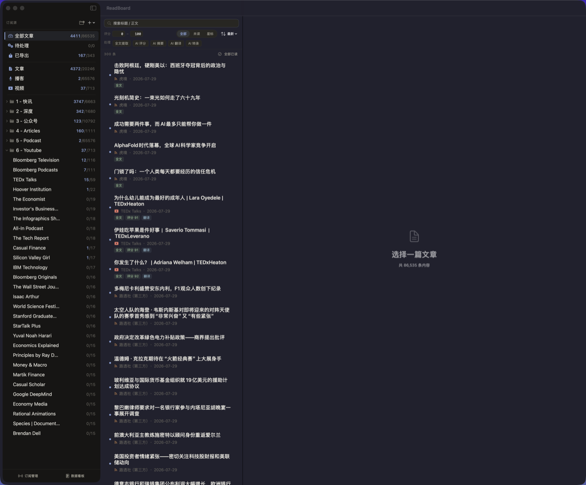
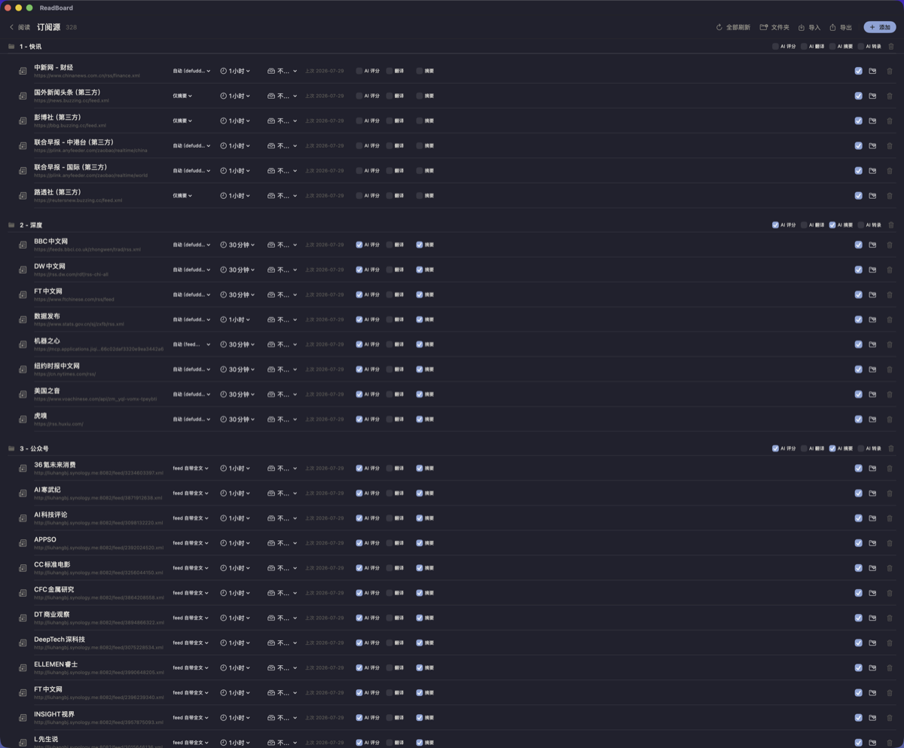
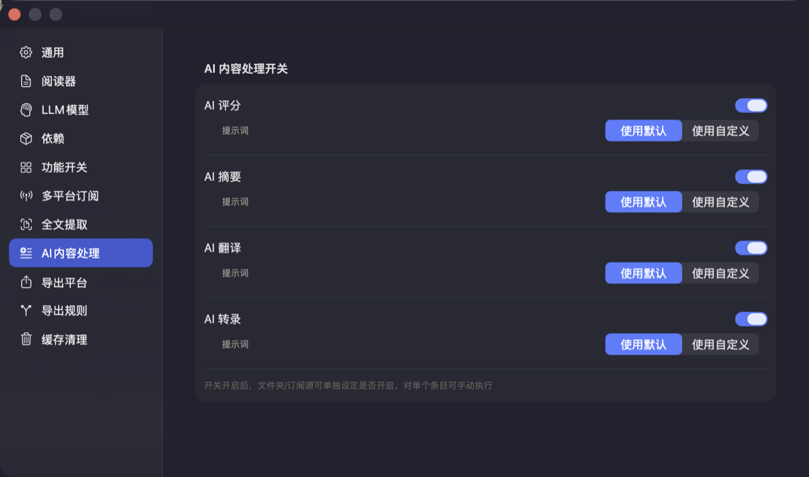
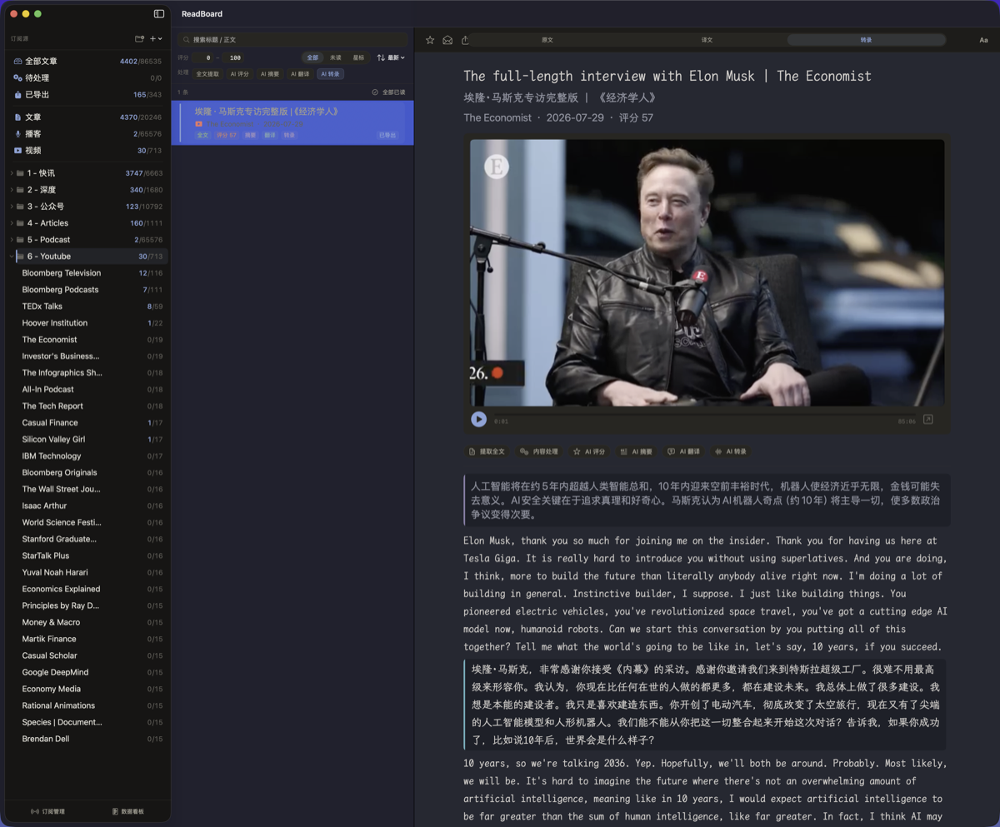
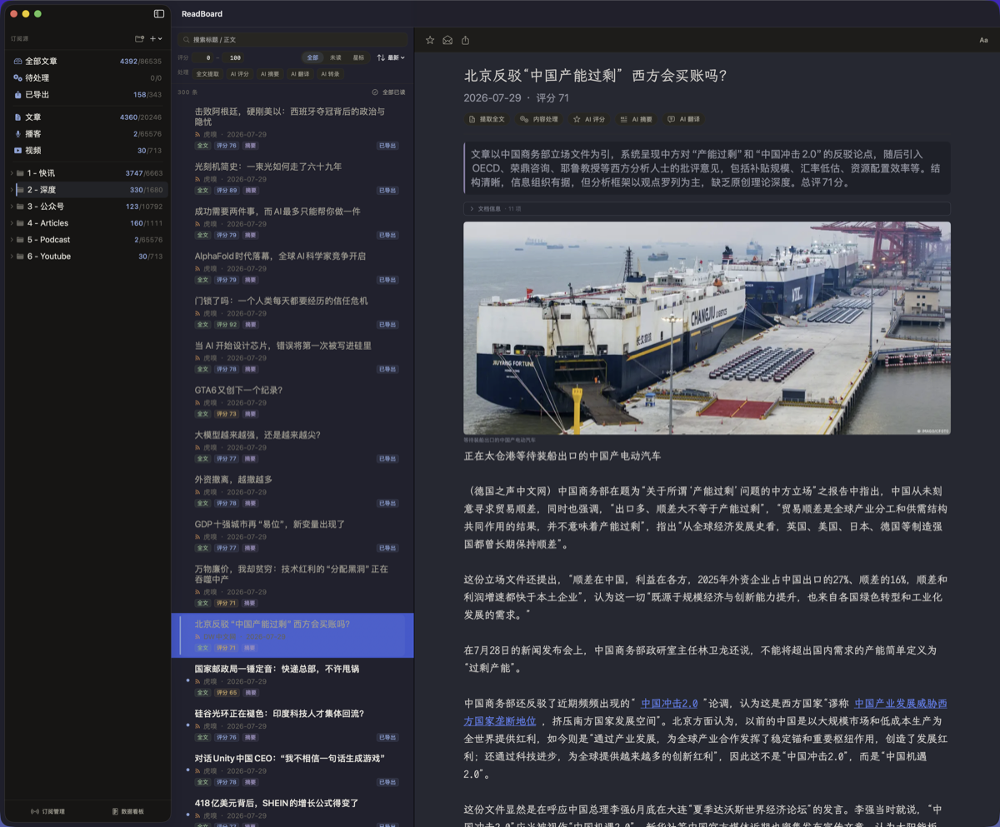
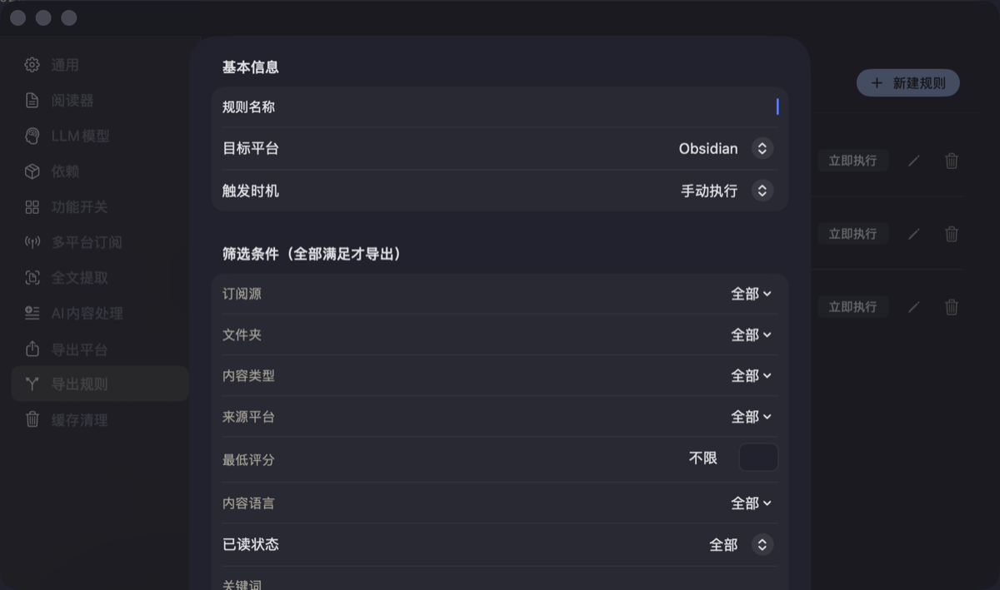
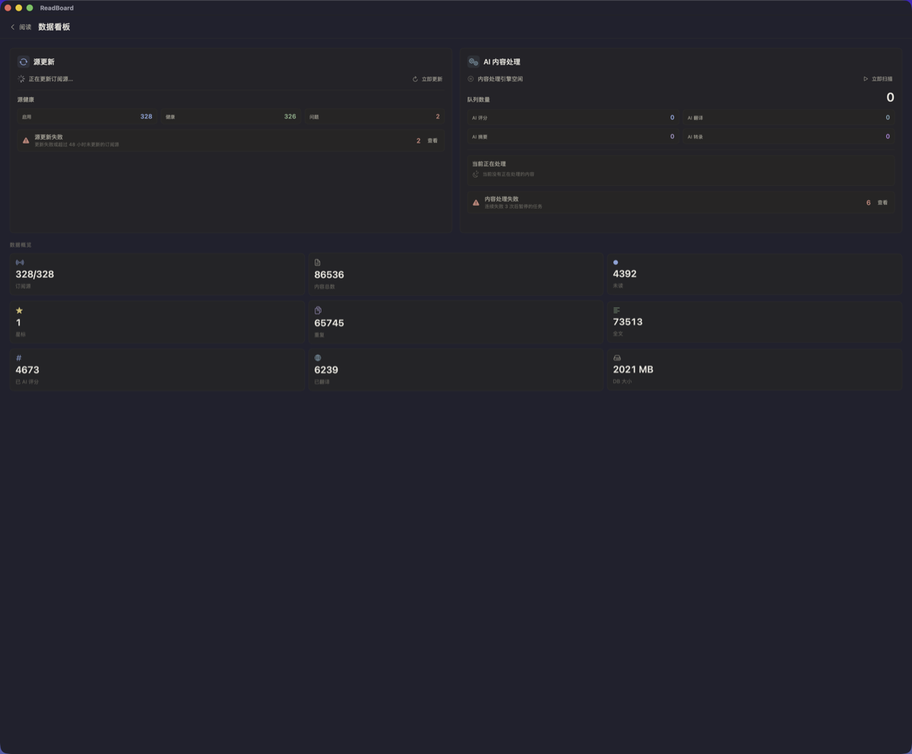

# ReadBoard

**信息整合与加工中台。服务你和你的 Agent。**

在 AI 时代，信息是割裂的。上游是分散的 RSS、播客、YouTube，中游是散落各处的 AI 处理能力，下游是各自为政的笔记和知识库软件。我们的信息从未真正汇合——人在不同阅读器之间切换，Agent 在不同的 API 之间跳转，加工结果散落各处，没有一个统一的处理层。

ReadBoard 在这个断裂的链路中间，架设了一个信息中台。

它的核心设计不是"功能多"，而是角色的转换。传统阅读器帮你"看"信息，ReadBoard 帮你"加工"信息，然后把成品分发给你选择的知识库——包括你自己，也包括你的 Agent。



---

## 中台的三层结构

### 上游 · 信息接入层：均质化

一篇 RSS 文章、一期播客、一个 YouTube 视频，进了 ReadBoard 就是同一种东西。全文、摘要、译文、转录稿存在同一套字段里，加工走同一条 pipeline，导出用同一套规则筛选。你可以跨类型思考：所有评分高于 7 的英文内容、所有待翻译的播客、所有中国信源今天发布的内容。不需要打开三个应用。



### 中游 · 信息加工层：AI 作为核心工序

评分、摘要、翻译、转录不是附加功能，是四道独立的加工工序。每条内容有四个独立的自动处理开关和四个独立的结果字段。Worker 扫描时根据当前配置动态判断一篇文章是否该进入 pipeline——配置驱动，不是任务驱动。



文件夹级关闭自动翻译，所有下属条目的开关级联置零，Worker 下一轮自动跳过。没有"取消队列"这个动作。每道工序受内容锁保护，Worker 和手动触发不会同时调用同一篇内容的 LLM。加工完成的信号不只是在界面上打一个标签——它唤醒导出规则引擎，触发分发。





### 下游 · 信息分发层：导出作为一等公民

导出不是"保存为 Markdown"的附加功能，而是一套独立的规则引擎。

触发时机可选：入库 / 加工完成 / 星标 / 定时 / 手动。

匹配条件自由组合：来源、文件夹、内容类型、平台、评分、语言、关键词。

完成条件可要求译文、转录、摘要全部就绪后才导出。

输出配置：目录模板、文件名模板、Frontmatter 字段名自定义映射。

交付记录：幂等去重、版本追踪、内容哈希比对。改一条规则，系统知道哪些内容需要重新导出。

这是发布-订阅模式的导出，不是导出一份就结束。



Obsidian 是第一个适配的导出端。MCP 服务已在计划中，届时 Agent 可以直接通过 BM25 检索你的加工后知识库。



---

## 不是阅读器

ReadBoard 不理解"阅读器"这个概念。它理解的是内容类型（article / podcast / video），并根据类型自动选择加工路径：文章提取全文，播客转录后摘要，YouTube 拉字幕。

人和 Agent 共享同一份数据——人对三栏原生阅读视图，Agent 对 MCP 服务。SQLite + FTS5 全文搜索，全部本地，零云端依赖。LLM API Key 你自己配，换模型不用改代码。

---

## 设计要点

**信息均质化。** 来源不重要——RSS、播客、YouTube 入库后是同一种记录。跨类型的筛选、加工、导出用同一套规则。

**配置级联。** 修改文件夹的 AI 设置，自动级联到所有下级源和条目。Worker 不需要维护固定队列，每次扫描按当前配置动态判断。

**内容锁防重复计费。** Worker 领取任务前加锁，手动触发同样检查。同时只有一个 processor 调用 LLM。

**加工可追溯。** 四条独立的结果字段 + 四个独立的自动开关 + 内容哈希。修改提示词后，系统知道哪些需要重跑。

**导出幂等。** 版本追踪 + 内容哈希 + 规则修订号。变更规则或模板后，只重新导出受影响的内容。

**全本地。** SQLite + FTS5。零云端依赖。没有账号系统，没有遥测。

---

## 技术栈

SwiftUI · SQLite + FTS5 · Whisper · yt-dlp

macOS 14+ 原生应用

---

## 安装

从 [Releases](https://github.com/liuhangbj/ReadBoard/releases) 下载最新 `.app`，拖入 `~/Applications`。

首次启动需在设置中配置 LLM API Key 和 Obsidian Vault 路径（如需导出）。

---

## 开发

```bash
cd App/ReadBoard
swift build
swift test
```

---

## 许可证

MIT
